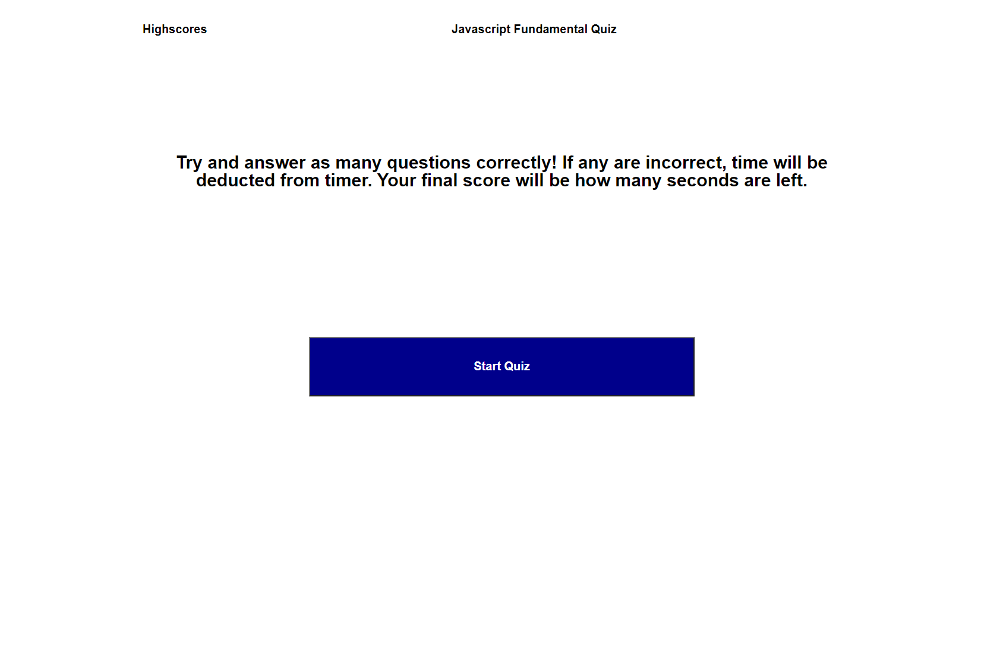

# Code Quiz

## Description

In this project, I made a Javscript Fundamental Quiz.

I made it completely from scratch. I made several functions for each question, and each funciton would have the question transition into the next question.

I have included several comments in the JS file how everything works

Overall, this was a challenging projects. Setting up the quiz was easy enough, but getting it fully functional was difficult. If I could do anything different, I would make the functions into an array, which could help the right or wrong fucntions work properly.

**Link**

Github Pages: https://johnclimie.github.io/CodeQuiz/